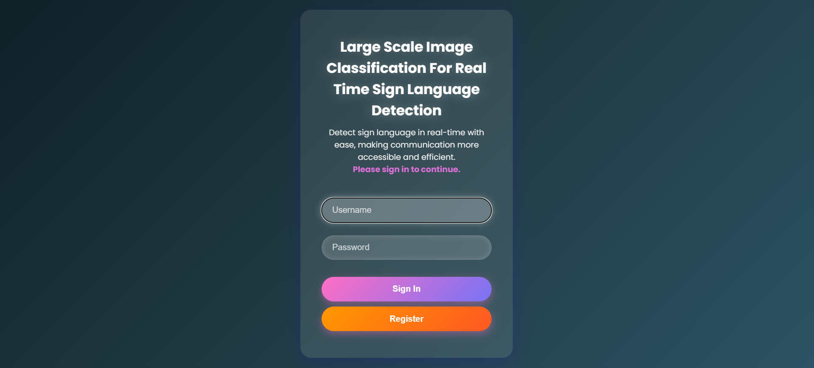
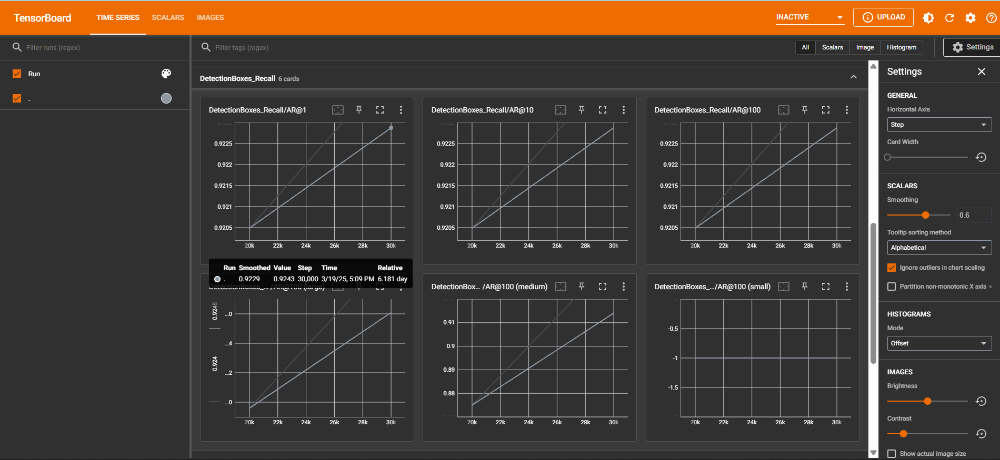

# Real-Time ASL Alphabet Recognition 🤟

   

A real-time American Sign Language (ASL) alphabet recognition system that leverages a custom-trained TensorFlow model to detect and classify hand gestures from a live webcam feed, presented through a responsive React.js web interface.



## 📖 Abstract

Interaction and communication for a person with hearing or speech impairments can be challenging. Sign Language simplifies this communication barrier. This project focuses on inclusion and accessibility by highlighting the importance of effective sign language recognition systems. We overcome the problem of connecting the communication gap by creating a strong, real-time sign language recognition system. Based on improvements in deep learning, the suggested system interprets sign language gestures captured through a camera and converts them into text in real-time. The model is trained on a large custom dataset covering a wide range of hand gestures, leveraging Convolutional Neural Networks (CNNs) and transfer learning for high accuracy and low latency.

## ✨ Key Features

-   **Real-Time Detection**: Employs an optimized model for high-speed inference directly in the browser.
-   **High Accuracy**: Fine-tuned on a custom dataset of ASL gestures for reliable classification.
-   **Web-Based Interface**: Interactive and user-friendly UI built with React and TensorFlow.js.
-   **Scalable Architecture**: The TensorFlow Object Detection API structure allows for easy retraining and addition of new signs.
-   **Academic Foundation**: Backed by published research in the field of image classification and accessibility.

## 🛠️ Technology Stack

| Technology                                                                          | Description                                                               |
| ----------------------------------------------------------------------------------- | ------------------------------------------------------------------------- |
| **Python** | Core language for model training and data processing.                     |
| **TensorFlow Object Detection API** | The framework used for training the custom sign language detection model. |
| **React.js** | A JavaScript library for building the user interface.                     |
| **TensorFlow.js** | Enables running the machine learning model directly in the browser.       |
| **OpenCV** | Used for handling real-time video stream and image processing.            |
| **Jupyter Notebook** | For data collection, model training, and evaluation steps.                |

## 📂 Project Structure

The repository is organized into two main parts: model training and the web application.

sign-language-recognition/
├── .gitignore
├── LICENSE
├── README.md
│
├── model-training/
│   ├── 1_data_collection.ipynb
│   ├── 2_model_training_and_evaluation.ipynb
│   ├── 3_model_export.ipynb
│   ├── exported-tfjs-model/
│   └── tensorflow_object_detection/
│
├── web-app/
│   ├── public/
│   ├── src/
│   ├── package.json
│   └── ... (React app files)
│
└── docs/
├── journal_publication.pdf
└── tensorboard-metrics/
└── screenshots/

## ⚙️ Getting Started

Follow these instructions to get a copy of the project up and running on your local machine.

### Prerequisites

-   Python 3.10+
-   Node.js and npm
-   Anaconda (Recommended for managing Python environments)

### 🚀 Running the Web Application (Quick Start)

This will run the pre-trained model in the web interface.

1.  **Clone the repository:**
    ```bash
    git clone [https://github.com/your-username/sign-language-recognition.git](https://github.com/ekachitgvnarayan/sign-language-recognition.git)
    cd sign-language-recognition
    ```

2.  **Navigate to the web application directory:**
    ```bash
    cd web-app
    ```

3.  **Install dependencies:**
    ```bash
    npm install
    ```

4.  **Copy the pre-trained model:**
    The TensorFlow.js model required by the app is in the `model-training` folder. Copy it to the `public` directory of the web app.
    ```bash
    # From the 'web-app' directory:
    cp -R ../model-training/exported-tfjs-model ./public/model
    ```
    *(Note: On Windows, you might need to use `xcopy` or manually copy the `exported-tfjs-model` folder and rename it to `model` inside `web-app/public/`)*

5.  **Start the React application:**
    ```bash
    npm start
    ```
    Open your browser and navigate to `http://localhost:3000` to see the application in action!

### 🧠 Training Your Own Model (Optional)

If you wish to retrain the model or train it on your own data, follow the steps in the `model-training` directory.
Refer [TensorFlow Model Zoo](https://github.com/tensorflow/models/blob/master/research/object_detection/g3doc/tf2_detection_zoo.md) for to download the model. 
Clone the complete [repo](https://github.com/tensorflow/models.git) and paste it in model-training/tensorflow_object_detection/models

1.  **Set up the Python environment:**
    ```bash
    cd model-training
    # It is highly recommended to create a virtual environment
    pip install -r requirements.txt 
    ```
    *(**Note**: You may need to create a `requirements.txt` from the one in the root `TFODCourse` folder or install the TensorFlow Object Detection API dependencies manually.)*

2.  **Follow the Jupyter Notebooks:**
    The notebooks are numbered and designed to be run in order:
    -   `1_data_collection.ipynb`: Scripts to collect images for your dataset.
    -   `2_model_training_and_evaluation.ipynb`: The complete process for training the model and evaluating its performance using TensorBoard.
    -   `3_model_export.ipynb`: Script to convert the trained checkpoint into a TensorFlow.js web-friendly format.

## 📊 Model Performance

The model is based on **SSD MobileNetV2 FPNLite 320x320** and was trained for over 30,000 steps. The training metrics show a consistent increase in performance, as seen in the detection recall graph below from TensorBoard.



## 📜 Publication & Citation

This project and its findings were published in the **International Journal of Engineering Technology Research & Management (IJETRM)**.

-   **Title**: LARGE SCALE IMAGE CLASSIFICATION FOR REAL-TIME SIGN LANGUAGE RECOGNITION
-   **Journal**: IJETRM, Volume-09, Issue-03, March-2025
-   **ISSN**: 2456-9348
-   **DOI**: [zenodo DOI](https://doi.org/10.5281/zenodo.15089469)

If you use this work, please cite it as follows:

> Md. Mahabub Ali, Besha Abhishek, G. Ekachit Narayan Reddy, Kondi Varsha, Shada Manogna. "LARGE SCALE IMAGE CLASSIFICATION FOR REAL-TIME SIGN LANGUAGE RECOGNITION". *International Journal of Engineering Technology Research & Management*, Volume-09, Issue-03, March-2025.

You can find the full paper in the `docs` folder: [journal_publication.pdf](./docs/journal_publication.pdf).

## 📄 License

This project is distributed under the MIT License. See the `LICENSE` file for more information.
